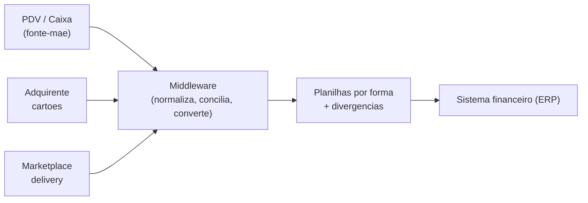

# Conciliador de Vendas para Sistema Financeiro

Automação de **conciliação financeira** e conversão de vendas para o modelo de
importação de um **sistema financeiro (ERP)**, para uma rede de franquia de
*food service* que vende por múltiplos canais (cartão, delivery, balcão).

O que antes era um processo manual — exportar relatórios de cada sistema, cruzar
tudo à mão e formatar planilhas — virou um pipeline que lê os relatórios do mês e
gera, em segundos, as planilhas prontas para importação **e** um relatório de
divergências.

> **Nota de privacidade.** Este repositório é uma vitrine técnica. Todos os dados,
> nomes de cliente, valores, NSUs e documentos foram **anonimizados ou omitidos**.
> Não há credenciais, arquivos reais ou informação sensível aqui.

---

## O problema

Uma operação de franquia registra todas as vendas num **sistema de PDV (caixa)**,
mas os recebíveis vivem espalhados:

- **Cartões** (débito, crédito, PIX) → adquirente (maquininha)
- **Delivery** → marketplace
- **Produtos de parceiro** e **dinheiro** → balcão

A área financeira precisa: (1) conferir se tudo que o PDV registrou realmente entrou
nas origens e com o valor certo, e (2) lançar tudo no **sistema financeiro**,
seguindo regras específicas por forma de pagamento (datas de vencimento,
categorias, descrições). Feito à mão, isso levava horas por mês e era sujeito a erro.

## A solução

Um **middleware** que consolida as fontes, concilia e converte para o modelo de
importação do sistema financeiro:



O **PDV é a fonte-mãe** (concentra todas as vendas); adquirente e marketplace
servem de **conferência**. Detalhes em [docs/ARQUITETURA.md](docs/ARQUITETURA.md).

## O que o pipeline faz

1. **Lê** os três relatórios do mês (detecta o layout automaticamente — o export do
   adquirente tem cabeçalho institucional variável).
2. **Filtra** apenas vendas efetivadas (exclui canceladas e valores ≤ 0).
3. **Normaliza** cada venda para um registro único (data, valor, taxa, NSU, NFC-e).
4. **Concilia** marketplace × PDV por valor e sinaliza divergências.
5. **Converte** para o modelo de importação aplicando as regras por forma de
   pagamento.
6. **Gera** as planilhas (uma por forma) + a de divergências, prontas para importar.

## Resultado

Uma execução por linha de comando gera as planilhas de lançamentos — **uma por
forma de pagamento** (débito, crédito, PIX, dinheiro, parceiro, marketplace) — mais
uma planilha de **divergências** (pedidos sem nota correspondente no PDV, para
conferência). Cada planilha já sai no layout de importação do sistema financeiro
(abas `Orientações` + `Dados`), pronta para ser importada.

## Validação

O pipeline foi validado em **três meses reais** de operação, com:

- **100% de integridade estrutural** em todas as planilhas (datas válidas,
  categorias corretas, campo de recebimento em branco, sem valores ≤ 0).
- **Batimento exato** dos totais de uma das formas de pagamento contra o resultado
  do processo manual anterior, nos três meses — evidência de que as regras foram
  fielmente reproduzidas.
- Feriados e fins de semana tratados automaticamente (a data de vencimento vem da
  *data prevista de pagamento* informada pelo próprio adquirente).

A validação do terceiro mês, inclusive, revelou um caso de vendas canceladas que
vazavam como lançamentos — hoje corrigido por um filtro de efetivação.

## Como usar

Requisito: Python 3.9+ e `openpyxl`.

```bash
pip install openpyxl
```

Coloque os três relatórios do mês numa pasta e rode:

```bash
python src/gerar_planilhas.py ./dados/2026-05 mai2026
```

As saídas ficam em `./dados/2026-05/SAIDA_Financeiro/`. Veja os nomes de arquivo
esperados em [exemplos/README.md](exemplos/README.md).

## Documentação

- [docs/ARQUITETURA.md](docs/ARQUITETURA.md) — arquitetura, diagramas e decisões
- [docs/MODELO_IMPORTACAO.md](docs/MODELO_IMPORTACAO.md) — regras por forma de pagamento
- [docs/CONCILIACAO.md](docs/CONCILIACAO.md) — lógica de conciliação e divergências
- [docs/APIS.md](docs/APIS.md) — viabilidade de integração via API
- [ROADMAP.md](ROADMAP.md) — próximos passos (Docker on-premise, agente de conciliação)

## Stack

- **Python** + **openpyxl** para leitura/escrita de planilhas
- Diagramas em **Mermaid**
- Roadmap: **Docker** (execução on-premise) e integração com a **API do sistema
  financeiro**

## Roadmap resumido

- [x] Pipeline de conversão + conciliação por arquivos
- [x] Validação em 3 meses de operação
- [ ] Empacotamento em **Docker** para rodar na rede do cliente
- [ ] **Interface web** (upload dos relatórios → download das planilhas prontas)
- [ ] Integração com a **API do sistema financeiro** (criar/editar lançamentos)
- [ ] **Agente** que efetiva a baixa/conciliação no ERP

## Licença

[MIT](LICENSE).
