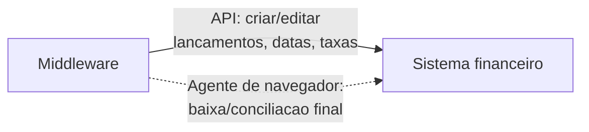

# Integração com APIs (pesquisa)

Levantamento de viabilidade das APIs envolvidas, feito na fase de concepção. Hoje o
pipeline trabalha por **arquivos** (exports mensais); as APIs são o caminho da
evolução para tempo (quase) real. Os detalhes abaixo são de natureza técnica e
genérica; nenhum dado ou credencial está aqui.

## Adquirente de cartões

- **Extrato eletrônico (EDI):** entrega padronizada de vendas, pagamentos e saldos,
  incluindo NSU, autorização, taxas (MDR), líquido e data de repasse. Entregue em
  **arquivos estruturados** (layout posicional), em lote (tipicamente D+1).
- **API de conciliação (REST/OAuth 2.0):** voltada a conciliadoras; exige
  credenciamento como parceiro.
- Observação: o dado de recebíveis é *batch*, não streaming.

## Marketplace de delivery

- **Order API:** pedidos com número, itens, horário, valor e status.
- **Módulo financeiro:** conciliação, eventos financeiros, repasses (*settlement*) e
  antecipação — comissões, taxas e valor líquido por pedido.
- Acesso mediante homologação como parceiro (OAuth `clientId`/`clientSecret`).
- Ponto fiscal: em parte dos casos a nota é emitida pelo próprio marketplace; por
  isso a NFC-e é obtida do PDV.

## Sistema de PDV

- Fonte-mãe do processo. Integração via **exportação de relatórios** (Excel).
  API sob demanda/contato comercial — não é o caminho atual.

## Sistema financeiro (ERP)

API REST + OAuth 2.0, sem *webhooks* (usa-se *polling*). Módulo financeiro —
recursos relevantes para este projeto:

| Recurso | Método | Uso |
|---|---|---|
| Contas a receber / a pagar | `POST` | Criar lançamentos |
| Receitas / despesas | `GET` | Consultar por filtro |
| Parcela | `GET`, `PATCH` | Ler e **editar** (vencimento, data prevista, NSU, método, conta, composição de valor: bruto, líquido, taxa, desconto, juros, multa) |
| Contas financeiras / saldo | `GET` | Consultar saldos |
| Eventos alterados no período | `GET` | *Polling* (substituto de webhook) |

**Limitação relevante:** não há endpoint para criar a **baixa/conciliação** — os
campos de conciliação são apenas leitura. Ou seja, a API cobre criar e editar
lançamentos e ajustar datas/taxas com robustez, mas a *baixa efetiva* provavelmente
exige a interface do sistema.

## Consequência para a arquitetura

A parte robusta (ler, criar, ajustar) vai por **API**; apenas o clique final de
conciliação — que a API não expõe — fica para um **agente de navegador** (roadmap).
Isso mantém a superfície frágil de automação de tela a menor possível.
