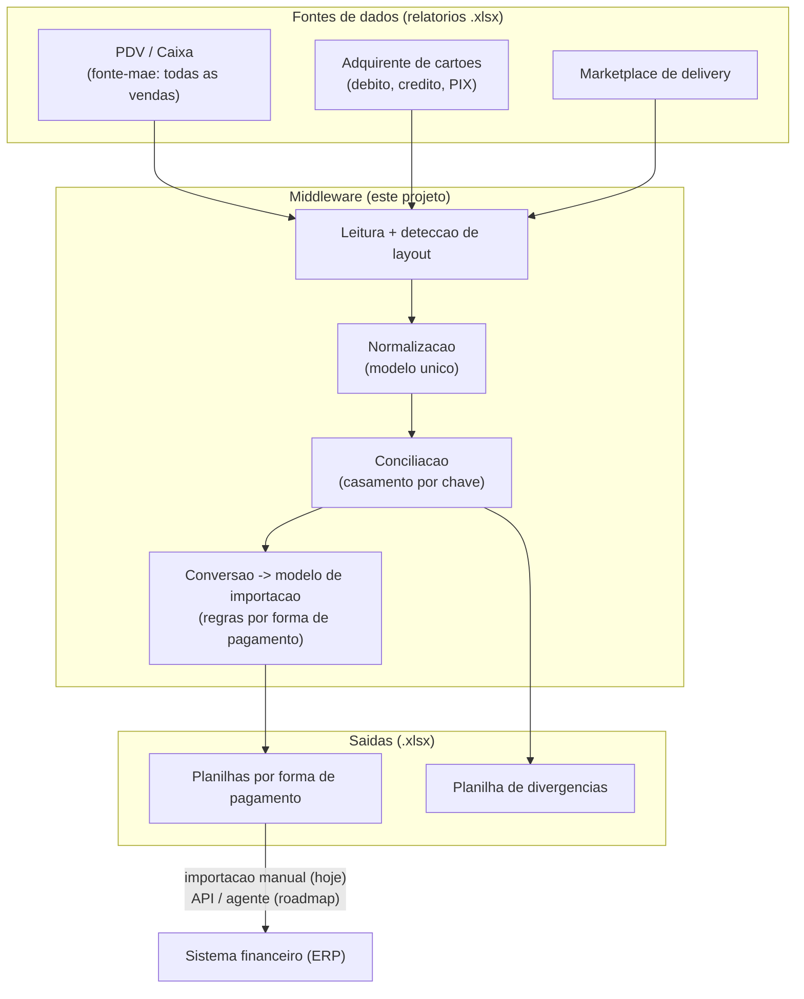
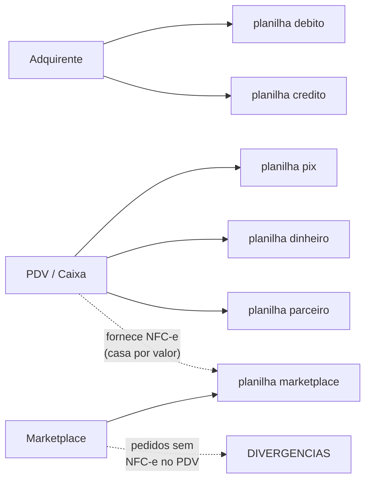
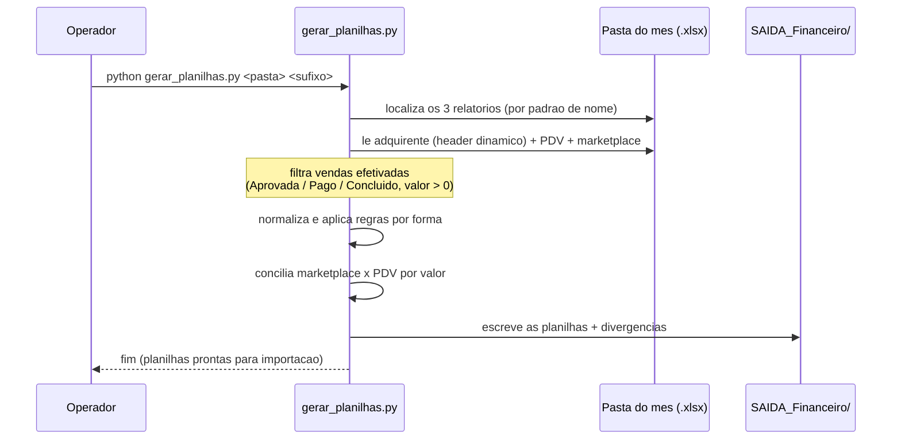

# Arquitetura

## Contexto

Uma rede de franquia de *food service* vende por múltiplos canais — cartão
(débito/crédito/PIX na maquininha), delivery por marketplace, produtos de um
parceiro e dinheiro no balcão. Todas essas vendas passam por um **sistema de PDV
(caixa)**, que é a **fonte-mãe**. A operação financeira usa um **sistema financeiro
(ERP)**, alimentado por importação de planilhas.

O trabalho manual consistia em: exportar relatórios de cada sistema, cruzar tudo,
converter para o layout de importação (com regras específicas por forma de
pagamento) e importar. Este projeto automatiza esse processo.

## Princípio central

> Nenhum sistema conversa diretamente com o outro. Um **middleware** no meio puxa
> cada fonte, normaliza para um modelo único, concilia e entrega para o sistema
> financeiro.

O PDV concentra tudo; adquirente e marketplace servem de **conferência** (a venda
que o PDV registra realmente consta na origem? o valor bate?).

## Visão geral

## Fluxo de dados por forma de pagamento

Cada forma de pagamento tem uma origem e um destino bem definidos:

## Pipeline interno

## Componentes

| Componente | Responsabilidade |
|---|---|
| **Leitura / detecção de layout** | Localiza os 3 arquivos por padrão de nome; acha a linha de cabeçalho do adquirente dinamicamente (o export tem cabeçalho institucional variável); casa colunas por nome/prefixo (robusto a acento). |
| **Filtro de efetivação** | Descarta vendas não concluídas (`Cancelado`, status ≠ `Aprovada`/`Concluído`) e linhas de valor ≤ 0. |
| **Normalização** | Converte cada linha das fontes para um registro único (data, valor, taxa, NSU, cupom/NFC-e, forma). |
| **Conciliação** | Casa marketplace × PDV **por valor** (o nº de pedido difere entre sistemas). Marca divergências. |
| **Conversão para importação** | Aplica as regras de data, categoria e descrição por forma de pagamento e escreve no layout de importação (abas `Orientações` + `Dados`). |

## Decisões de arquitetura

- **PDV como fonte-mãe:** evita integrar N sistemas separados; as demais fontes só
  conferem. Reduz drasticamente o acoplamento.
- **Datas de vencimento vindas do adquirente:** em vez de calcular `D+1`/`D+31`,
  usa-se a *data prevista de pagamento* que o próprio adquirente informa — cobre
  fins de semana e feriados sem tabela auxiliar.
- **Conciliação por valor (não por nº de pedido):** verificou-se empiricamente que
  o número de pedido do marketplace **não** é o mesmo do PDV; o valor dos itens do
  marketplace, porém, casa com a venda bruta do PDV.
- **Detecção dinâmica de layout:** os exports mudam de formato ao longo do tempo
  (ver [riscos](#riscos)); o código não fixa posições de coluna.
- **On-premise (roadmap):** empacotamento em Docker para rodar na rede do cliente,
  apenas com chamadas de saída — os dados financeiros não saem do ambiente dele.

## Riscos conhecidos

| Risco | Mitigação |
|---|---|
| Layout dos exports muda (colunas renomeadas/reordenadas) | Detecção dinâmica de header e casamento de coluna por nome/prefixo. |
| Uma venda com o mesmo valor no mesmo dia (ambiguidade no casamento) | Casamento em fila (FIFO) por (data, valor); excedentes viram divergência para conferência manual. |
| API do sistema financeiro não expõe "baixa"/conciliação | Escrita robusta via API para criar/editar; a baixa final fica para o agente de navegador (roadmap). |
| Emissão fiscal no marketplace pode ser do próprio marketplace | NFC-e sempre obtida do PDV, não do marketplace. |

Ver também [MODELO_IMPORTACAO.md](MODELO_IMPORTACAO.md), [CONCILIACAO.md](CONCILIACAO.md)
e [APIS.md](APIS.md).
