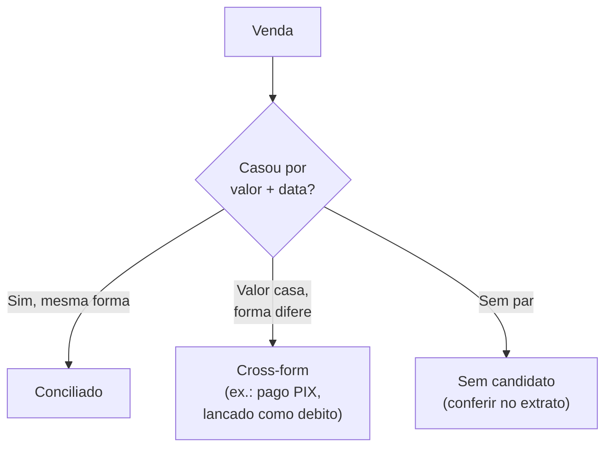

# Conciliação e divergências

A conciliação confere se as vendas registradas na fonte-mãe (PDV) realmente
constam nas fontes de origem (adquirente e marketplace) e com os valores corretos.

## Chave de casamento

`valor + data`, com tolerância de horário. O **NSU** (comprovante do cartão) é a
chave forte quando disponível.

- **PIX** que transita pelo terminal do adquirente: casa dentro de uma pequena
  janela de tempo (poucos minutos).
- **Crédito/Débito:** casa por valor + data; diferença de horário grande é
  sinalizada para revisão.
- **Marketplace × PDV:** casa **por valor** — o número de pedido do marketplace
  **não** é o mesmo do PDV, mas o *valor dos itens* do marketplace corresponde à
  *venda bruta* do PDV.

## Por que não casar por número de pedido

Verificação empírica: o marketplace usa IDs curtos próprios (ex.: `1676`), enquanto
o PDV usa uma numeração interna independente (ex.: `23817`). Não há relação direta
entre eles. O valor, porém, é idêntico entre as duas fontes, o que torna o valor a
chave prática de conciliação.

Quando há **mais de uma venda com o mesmo valor no mesmo dia**, o casamento é feito
em fila (FIFO); os excedentes que não encontram par viram divergência para
conferência manual.

## Tipos de divergência

| Tipo | Significado | Ação |
|---|---|---|
| **Conciliado** | Valor e forma batem entre as fontes | Nenhuma |
| **Cross-form** | O adquirente processou numa forma e o PDV registrou em outra (ex.: cliente pagou PIX na maquininha, operador lançou como débito) | Corrigir lançamento / acionar operacional |
| **Sem par** | Não há venda correspondente na outra fonte | Conferir diretamente no extrato bancário |

## Planilha de divergências (marketplace)

O pipeline gera `DIVERGENCIAS_ifood_sem_nfce_<sufixo>.xlsx` com os pedidos do
marketplace que **não** encontraram NFC-e correspondente no PDV — para conferência
um a um. Colunas: Data, Hora, ID curto, ID completo, valor dos itens, total pago,
valor líquido e forma de pagamento.

Boa parte dessas divergências costuma ser ambiguidade de valores iguais no mesmo
dia; o restante são pedidos que realmente não constam no PDV e merecem investigação.

## Achado operacional

Ao longo dos meses analisados, observou-se uma tendência de aumento de
**cross-forms crédito → débito** no adquirente. Como o total de transações do dia
costuma bater, mas a divisão entre crédito e débito não, o padrão sugere um
problema de operação no PDV (e não apenas ruído de conciliação) — o tipo de insight
que a automação torna visível.
