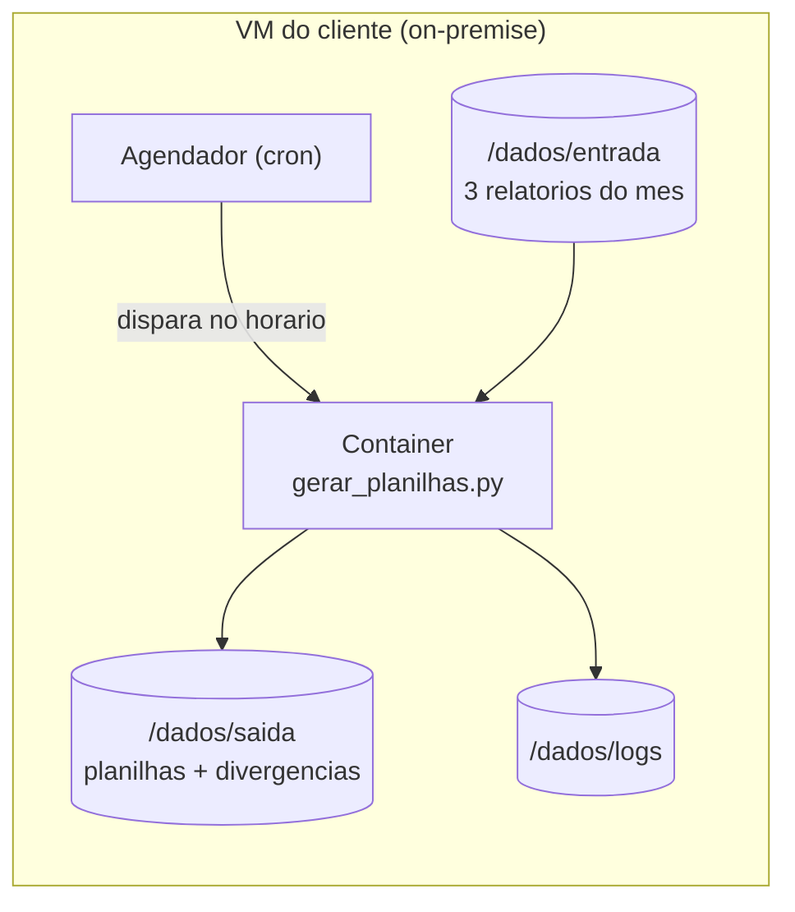
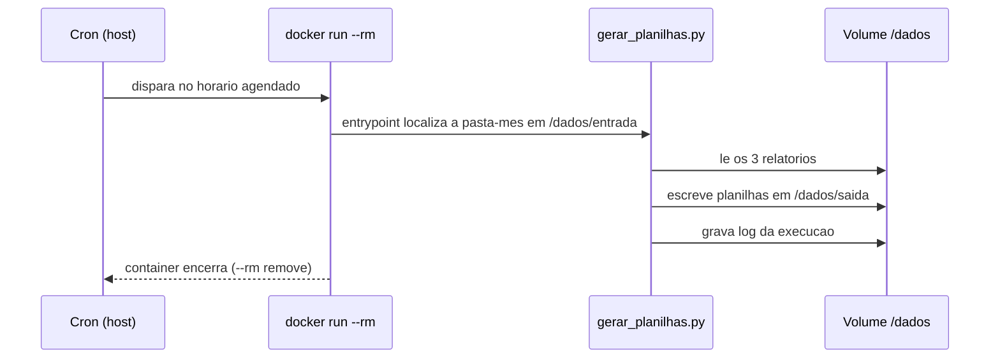

# Deploy on-premise com Docker (plano — Fase 2)

> Status: **planejado** (design). Ainda não implementado — este documento descreve
> a arquitetura de deploy antes da construção.

## Objetivo

Empacotar o pipeline num container que roda **na rede do próprio cliente** (VM
on-premise), de forma **agendada (cron)**: num horário fixo, o container processa os
relatórios que estiverem na pasta de entrada e grava as planilhas na pasta de saída.

Por que on-premise: os dados financeiros **não saem do ambiente do cliente**; o
container só faz chamadas de saída (quando/se as APIs entrarem, em fases futuras).
Nenhuma porta de entrada é exposta.

## Visão de deploy



## Estrutura de pastas (volumes)

O host (VM) expõe uma pasta que é montada no container como volume:

```
/dados
├── entrada/        # os 3 relatorios do mes sao colocados aqui
│   └── 2026-05/
├── saida/          # o container escreve aqui (SAIDA_Financeiro por mes)
└── logs/           # registro de cada execucao
```

Mapeamento no `docker run`: `-v /caminho/no/host/dados:/dados`.

## Dockerfile (esboço)

Imagem mínima, só o necessário para rodar o pipeline:

```dockerfile
FROM python:3.12-slim
WORKDIR /app
COPY requirements.txt .
RUN pip install --no-cache-dir -r requirements.txt
COPY src/ ./src/
COPY docker/entrypoint.sh .
RUN chmod +x entrypoint.sh
ENTRYPOINT ["./entrypoint.sh"]
```

O `entrypoint.sh` descobre a pasta-mês mais recente em `/dados/entrada`, roda o
pipeline apontando a saída para `/dados/saida` e registra em `/dados/logs`.

## Execução agendada

Duas opções (a decidir na construção):

1. **Cron do host** (mais simples): o host tem uma linha de cron que dispara um
   `docker run` que processa e encerra o container.

   ```cron
   # todo dia 1o as 08:00 — processa o mes anterior
   0 8 1 * *  docker run --rm -v /srv/conciliador/dados:/dados conciliador:latest
   ```

2. **Cron dentro do container** (container sempre de pé): usa um agendador interno.
   Útil se o host não puder ter cron, mas o container fica rodando ocioso.

Para o MVP, a **opção 1 (cron do host + `--rm`)** é a recomendada: o container sobe,
faz o trabalho e some, sem processo ocioso.

## Fluxo de uma execução



## Escopo do MVP (Fase 2)

Incluído:

- [ ] `Dockerfile` (imagem slim + openpyxl)
- [ ] `docker/entrypoint.sh` (descobre pasta-mês, roda pipeline, escreve log)
- [ ] Volumes de entrada/saída/logs
- [ ] Exemplo de linha de cron no host
- [ ] README de deploy (build da imagem, `docker run`, agendamento)

Fora do escopo desta fase (fica para depois):

- Controle de idempotência formal (não reprocessar o mesmo mês) — no MVP, o nome
  do arquivo de saída por mês já evita retrabalho.
- Logs estruturados / observabilidade.
- `docker-compose` e variáveis de ambiente para múltiplos clientes.
- Integração com a API do sistema financeiro (Fase 3).

## Decisões registradas

- **Execução:** agendada por **cron** (host), container efêmero (`--rm`).
- **Robustez:** **MVP funcional** — roda de verdade, enxuto.
- **Repositório:** este documento vive no repositório do projeto; o `Dockerfile` e o
  `entrypoint.sh` serão adicionados quando a construção começar.

Ver [ARQUITETURA.md](ARQUITETURA.md) para o pipeline e [ROADMAP.md](../ROADMAP.md)
para as fases.
